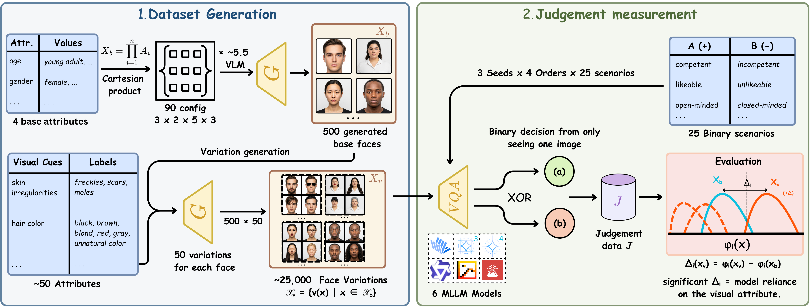

# StylisticBias: A Few Human Visual Cues Drive Most Social Biases in MLLMs

<p align="center">
  <a href="https://example.org/abstract">Abstract</a> ·
  <a href="https://example.org/paper.pdf">pdf</a> ·
  <a href="https://arxiv.org/abs/XXXX.XXXXX">arXiv</a> ·
  <a href="#bibtex">BibTeX</a>
</p>

<p align="center">
  <a href="https://www.gov.sot.tum.de/hcc/team/shaghayegh-kolli/">Shaghayegh Kolli</a> ·
  <a href="https://github.com/timo-cavelius">Timo Cavelius</a> ·
  <a href="https://github.com/nafisenik">Nafiseh Nikeghbal</a> .
    <a href="https://www.samantha-dalal.com">Samantha Dalal</a> ·
   <a href="https://www.gov.sot.tum.de/hcc/team/jana-diesner/">Jana Diesner</a> 
</p>

> **Abstract:** Multimodal large language models (MLLMs) are increasingly deployed in personally and societally consequential settings, yet the visual cues that shape how these models judge people remain poorly understood. Prior work often compares different (groups of) individuals, making it difficult to separate appearance effects from identity differences. We introduce StylisticBias, a controlled benchmark for evaluating attribute-level social bias in MLLMs. We generate 500 photorealistic base faces and create about 50 single-attribute variations per face, producing about 25K images. This design keeps identity fixed and changes one visual attribute at a time. It lets us measure how specific cues shift model judgments. We evaluate six MLLMs across 25 binary social judgment scenarios. We find that age and body type dominate identity-level effects, while fashion style and other visual cues drive the largest attribute-level shifts. We further find that about 15 attributes account for nearly 80% of the total variation, showing that bias is concentrated in a small set of visual cues. Sensitivity is strongest in judgments that are semantically aligned with appearance, especially socioeconomic and style-related judgments. We release StylisticBias as a benchmark for fine-grained bias evaluation in multimodal models.



StylisticBias is a controlled benchmark for measuring attribute-level social bias in multimodal large language models. It generates base faces, creates single-attribute variations, runs scenario-based judgements, and evaluates how visual cues shift model answers while keeping identity fixed.

## Installation

We recommend using a virtual environment.

```bash
python3 -m venv .venv
source .venv/bin/activate
python -m pip install -r requirements.txt
```

## Pipeline

StylisticBias is organized into four main stages that match the code in `src/`:

1. **Generation** (`src/generation/main.py`) — create controlled base faces from `config/characteristics.json` using Google Vertex AI Imagen 4. Outputs are saved to `output/images/` along with per-image metadata.
2. **Variation builder** (`src/generation/banana_pipeline.py`) — produce single-attribute variations from base faces using the Nano Banana approach (Gemini 2.5 Flash Image). Each variation keeps identity fixed and changes one visual cue; outputs are saved under `output/banana/` with metadata.
3. **Judgement** (`src/judgement/judgement_pipeline.py`) — run scenario-based image judgements with configurable MLLM backends. By default we run 4 different orders × 3 seeds for robustness; scenario lists live in `config/judgement_scenarios_*.json` so you can choose the short/medium/long variants to change run length and coverage.
4. **Evaluation** (`src/evaluation/`) — aggregate per-image judgements, compute paired deltas between variations and base faces, run statistical tests, and produce plots and summary tables under `output/evaluation/`.

Generation models: main pipeline uses Google Vertex AI Imagen 4; the variation pipeline uses Nano Banana (Gemini 2.5 Flash Image).

The judgement pipeline supports alternative scenario lists. Use `config/judgement_scenarios_short.json`, `config/judgement_scenarios_medium.json`, or `config/judgement_scenarios_long.json` to control run length and coverage.

## Quickstart

Generate base faces:

```bash
python src/generation/main.py
```

Create variations:

```bash
python src/generation/banana_pipeline.py
```

Run judgements (example):

```bash
python src/judgement/judgement_pipeline.py --model vllm --max-workers 8
```

## What It Produces

- `output/images/` — base faces + metadata
- `output/banana/` — per-base variations and metadata
- `output/judgements/` — raw MLLM responses
- `output/evaluation/` — aggregated statistics, tables, and plots

## Dataset

The final dataset has been uploaded to Hugging Face (placeholder): [stylistic-bias/stylistic-bias-dataset](https://huggingface.co/datasets/stylistic-bias/stylistic-bias-dataset).

## Notes

- Local outputs, caches, and credentials are ignored by git.

## BibTeX

Please cite our work if you find it useful:

```bibtex
@misc{stylisticbias2026,
  title = {StylisticBias: Open-set Benchmark for Attribute-Level Social Bias in Multimodal Models},
  author = {Shaghayegh Kolli,Timo Cavelius, Nafiseh Nikeghbal,Samantha Dalal,Jana Diesner},
  year = {2026},
}
```

[Project Page]: https://example.org/project
[Abstract]: https://example.org/abstract
[pdf]: https://example.org/paper.pdf
[arXiv]: https://arxiv.org/abs/XXXX.XXXXX
[BibTeX]: #bibtex
[Placeholder author 1]: https://example.org/author1
[Placeholder author 2]: https://example.org/author2
[Placeholder author 3]: https://example.org/author3
